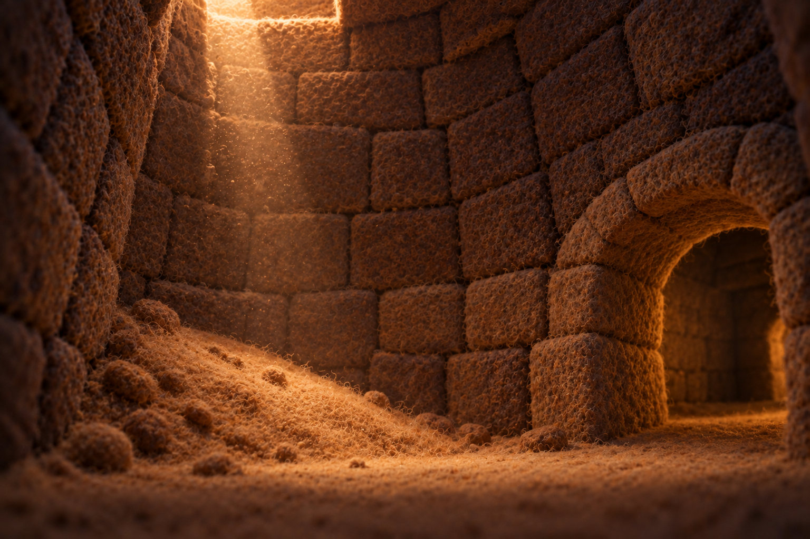
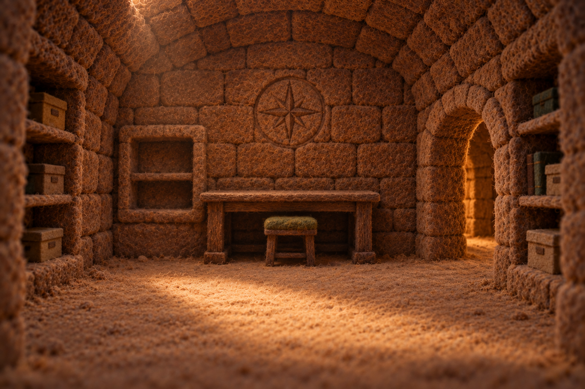
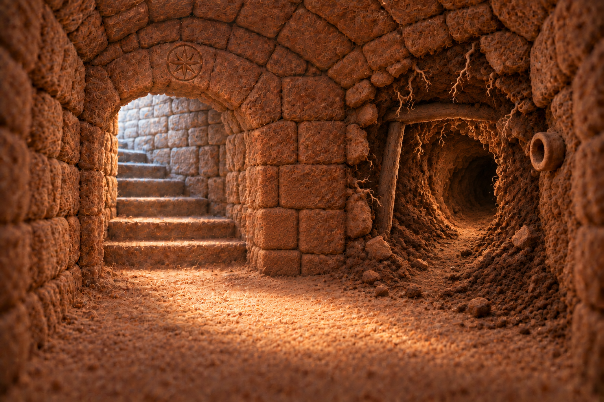
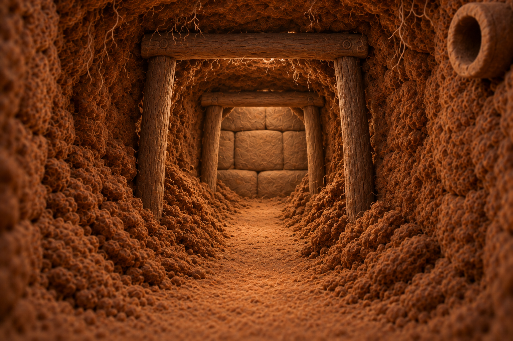
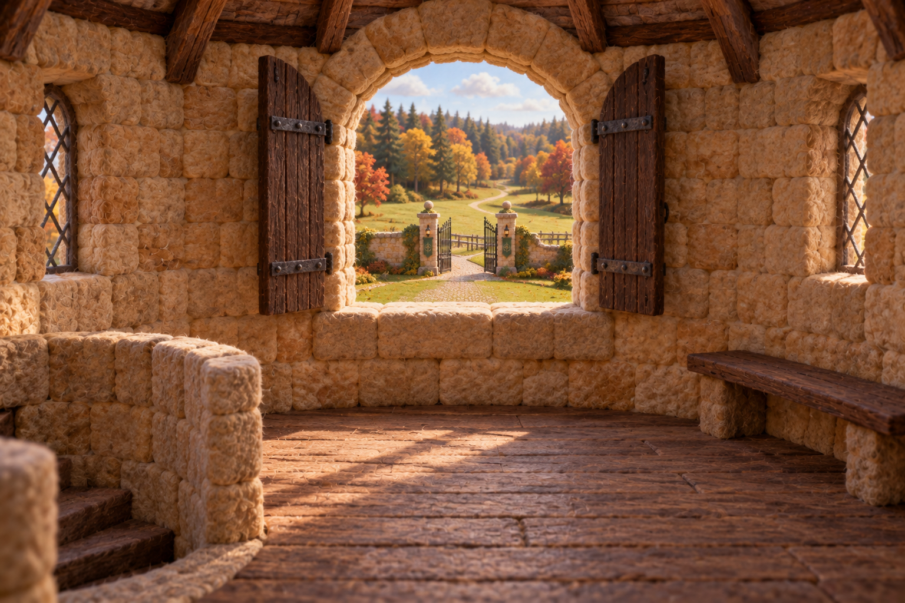
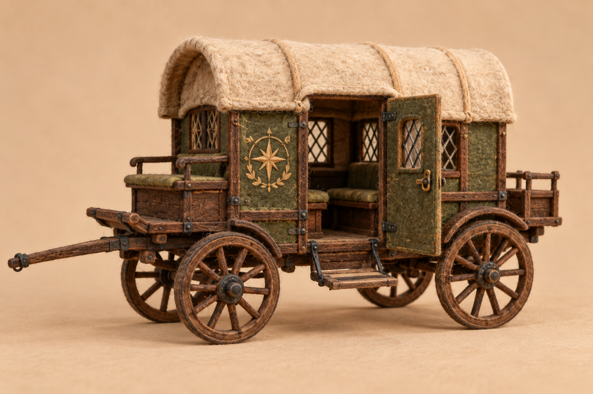
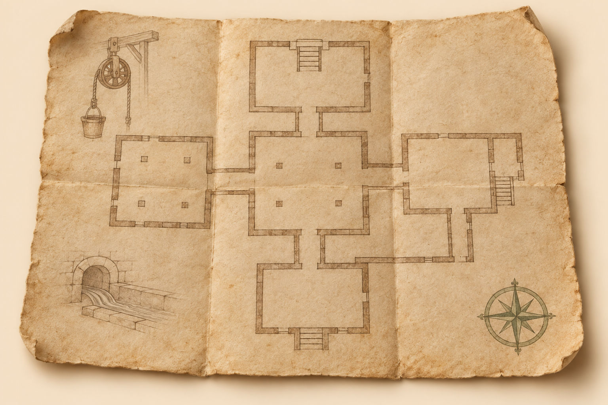
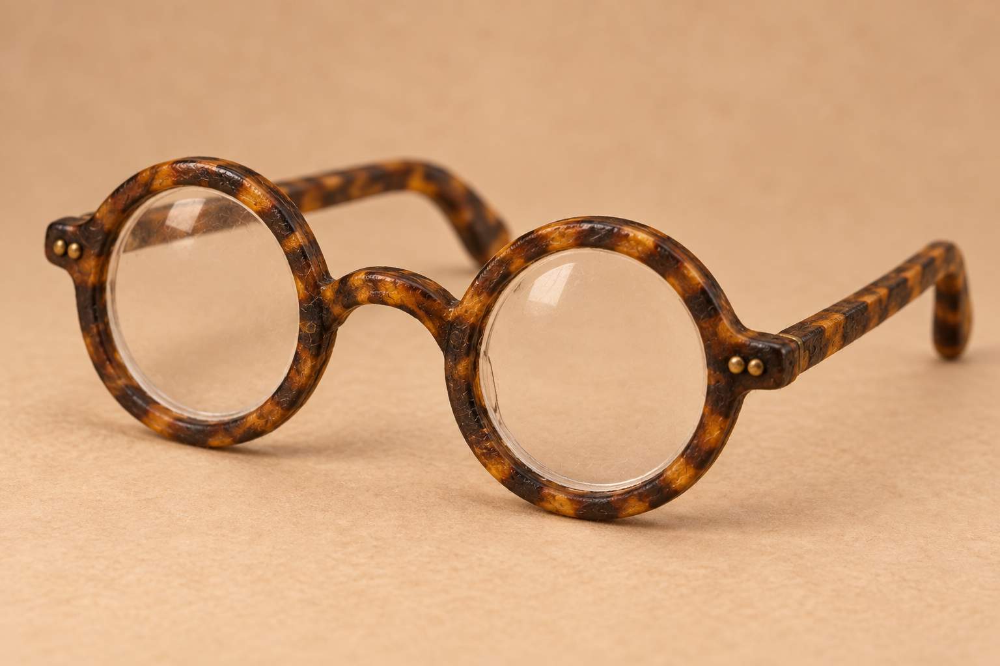

# Razzy — Act Two reference art

First reference pass, 2026-09-27. Eight selected PNG references made with the built-in image generation tool. Exact prompts sit beside the images in `_refs/`. These are reusable design references, not finished story illustrations or an implemented Act Two.

## Scope

Act Two follows the fall: underground discovery, the expedition leaving, evidence of recent digging, escape into the empty school, and sighting the approaching intruders. The siege belongs to Act Three. Existing references cover Razzy, Burrowes, the burglars, teachers, prefect, courtyard and entrance hall. Existing kitchen and dormitory scene art provides continuity for those rooms.

Burrowes spoke about his own wish to find the chamber; Razzy chose to investigate independently. Do not turn that conversation back into an instruction. Razzy's paste pot remains at the kitchen basin, not in his backpack. The reader starts at `meet_razzy`, the beginning of Act One. Act Two opens at `beneath_the_school` (B01), immediately after the fall. Act Two is now illustrated through the burglars’ arrival and Razzy’s realization. See [current script](act-two-script.md). The founder’s notebook replaces the standalone plans discovery, and the spectacles clue is no longer used.

## Locations

### Shaft landing

Sand bank at the foot of the shaft, one low exit at right. Keep the landing modest in height and show its relationship to the fall when composing the first scene. No dropped possessions baked into the set.

[Prompt](../../game/data/stories/razzy-the-rogue/_refs/shaft-landing-v1-prompt.txt)

### Founder’s chamber

Desk below compass emblem; document niche at left; passage doorway at right. The desk is empty in this reference. Add the plans in their chosen discovery position at scene stage, then preserve that position until Razzy moves them.

[Prompt](../../game/data/stories/razzy-the-rogue/_refs/founders-chamber-v1-prompt.txt)

### Underground junction

Old masonry and rising steps at left; freshly dug earth passage at right. The round clay outlet sits high in the right wall at the excavation entrance. Use this selected view as the master for both branches.

[Prompt](../../game/data/stories/razzy-the-rogue/_refs/underground-junction-v2-prompt.txt)

### Fresh excavation — superseded early concept

The image below is superseded by the rough junction v2 design; do not use it for new scene art. Earlier concept: two timber supports, side spoil heaps, downward grade, intact foundation blocks ahead. No vault contents are established. Spectacles and digging tools are scene props, not permanent furnishings. The drain connection to Potions and the route from outside must be resolved in the story map before the flooding sequence is written.

[Prompt](../../game/data/stories/razzy-the-rogue/_refs/fresh-excavation-v1-prompt.txt)

### Tower lookout

Broad central window with low sill, shutters folded back, stair opening at left and bench at right. Lawn, gate and treeline remain visible beyond. Add intruders and change to dusk when composing the closing scene.

[Prompt](../../game/data/stories/razzy-the-rogue/_refs/tower-lookout-v1-prompt.txt)

## Props

### Expedition carriage

Green-and-wood coach, cream roof, compass emblem, boarding step and facing benches. Reference is unloaded. Add occupants, bags and any visible draft team per scene; do not imply an unexplained self-moving vehicle. Departure can be staged at boarding without introducing a new recurring driver character.

[Prompt](../../game/data/stories/razzy-the-rogue/_refs/expedition-carriage-v1-prompt.txt)

### Founder’s plans

Folded cream sheet, sepia floor plan, marginal mechanism sketches and green compass mark. This establishes the prop's appearance. The generated room lines are provisional, not a solved navigation puzzle. Before a close-up carries a choice, make its route agree with the actual scene sequence. Keep the same finished diagram thereafter.

[Prompt](../../game/data/stories/razzy-the-rogue/_refs/founders-plans-v1-prompt.txt)

### Burrowes’s spare spectacles

Thick round amber-and-brown tortoiseshell frames derived from the office scene. The isolated reference has no case; add dust when found underground. Do not confuse these with the weasel's narrow brass glasses. Their presence is a clue, not sufficient proof by itself.

[Prompt](../../game/data/stories/razzy-the-rogue/_refs/burrowes-spectacles-v1-prompt.txt)

## Before scene art

Plan each choice and both outcomes before adding scene-specific objects. Reference illumination makes the architecture visible; establish how Razzy sees underground in the narrative rather than assuming these empty rooms have burning lamps. Keep the route from shaft to chamber to junction to school simple. Resolve the precise exit into an existing school room when drafting the escape. Reuse that room's established architecture.

No new treasure, vault interior, defense mechanism, library or roof design is fixed by this reference pass. Those depend on the later siege and reveal.

## Founder’s notebook — current story prop

Worn moss-green cloth, compass emblem, cream pages and russet ribbon. The plans are tucked into its back cover. It contains building accounts and sketches, including the gate and drains. [Prompt](../../game/data/stories/razzy-the-rogue/_refs/founders-notebook-v1-prompt.txt). Earlier spectacles and tower refs remain available but are unused in the current act.

## Current excavation continuity

Use underground-junction-v2 for both tunnel registry entries. Ragged earth, exposed roots, shovel marks, one rough support and a dark bend replace the orderly timber frames and masonry end wall. In both playable views, one muddy spade leans below the clay drain on the right, blade on the ground. It is a movable scene prop and is absent from the clean location reference.
